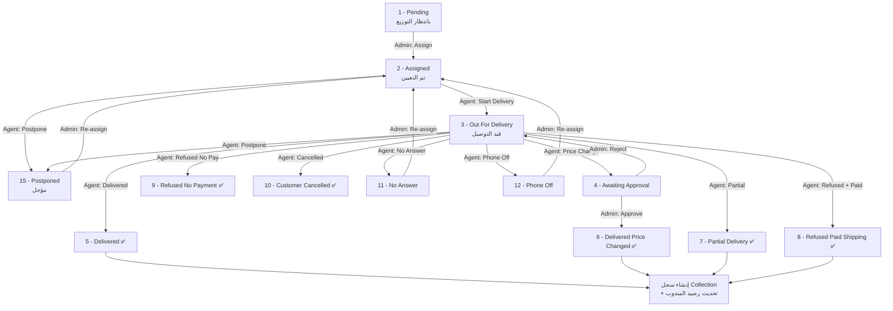

# دليل اختبار فلو الطلبات — Mersal

> **الجمهور:** فريق QA / التيستر  
> **النطاق:** دورة حياة الطلب من التعيين للمندوب حتى الإغلاق، مع صلاحيات الأدمن والمندوب وشركة الشحن  
> **آخر تحديث:** يونيو 2026 — مبني على الكود الحالي في المشروع

---

## 1. الأطراف المعنية

| الدور | الواجهة | ماذا يفعل في فلو الطلب |
|-------|---------|------------------------|
| **Super Admin** | لوحة الويب (Dashboard) | استيراد الطلبات، تعيين المندوب، مراجعة طلبات الموافقة، متابعة التحصيلات والتسويات |
| **Delivery Agent** | تطبيق الموبايل (Flutter) | استلام الطلب، تحديث الحالة، التحصيل، رفع إثبات التسليم، تأجيل الطلب |
| **Shipping Company** | تطبيق/بوابة الشركة | متابعة الطلبات والإشعارات فقط (قراءة — بدون تغيير حالة) |

---

## 2. جدول حالات الطلب (Order Statuses)

| ID | الكود | الاسم بالعربي | نهائي؟ | فيه تحصيل؟ | ملاحظات |
|----|-------|---------------|--------|-----------|---------|
| 1 | `pending` | بانتظار التوزيع | ❌ | ❌ | الحالة الافتراضية بعد إنشاء/استيراد الطلب |
| 2 | `assigned` | تم التعيين | ❌ | ❌ | بعد تعيين الأدمن للمندوب |
| 3 | `out_for_delivery` | قيد التوصيل | ❌ | ❌ | المندوب بدأ التوصيل |
| 4 | `awaiting_approval` | بانتظار الموافقة | ❌ | ❌ | يظهر عند طلب تغيير السعر — ينتظر قرار الأدمن |
| 5 | `delivered` | تم التسليم | ✅ | ✅ | تحصيل كامل |
| 6 | `delivered_price_changed` | تم التسليم بتغيير سعر | ✅ | ✅ | بعد موافقة الأدمن على السعر الجديد |
| 7 | `partial_delivery` | تسليم جزئي | ✅ | ✅ | تحصيل جزئي |
| 8 | `refused_paid_shipping` | رفض + دفع رسوم الشحن | ✅ | ✅ | العميل رفض الشحنة ودفع الشحن |
| 9 | `refused_no_payment` | رفض وعدم دفع رسوم الشحن | ✅ | ❌ | رفض كامل بدون مبلغ |
| 10 | `customer_cancelled` | ألغى العميل | ✅ | ❌ | إلغاء من العميل |
| 11 | `no_answer` | لا يوجد رد | ❌ | ❌ | العميل لا يرد — **المندوب لا يقدر يغيّر الحالة بعدها** |
| 12 | `phone_off` | الهاتف مغلق | ❌ | ❌ | نفس `no_answer` — يحتاج إعادة تعيين من الأدمن |
| 15 | `postponed` | مؤجل | ❌ | ❌ | العميل طلب تأجيل لتاريخ محدد |

> **حالات متقاعدة (غير مفعّلة في التطبيق حالياً):**  
> IDs: 13 (تهرّب/مختفي)، 14 (منطقة غير آمنة)، 16 (خارج المحافظة)، 17 (رقم هاتف خاطئ)

---

## 3. الفلو الكامل (نظرة عامة)



---

## 4. المرحلة 0 — قبل التعيين (Admin)

### 4.1 إنشاء الطلبات

| الطريقة | API | النتيجة |
|---------|-----|---------|
| استيراد Excel | `POST /api/v1/admin/orders/import` | إنشاء طلبات بحالة حسب عمود الحالة في الشيت، أو `pending (1)` إذا فارغ |
| استيراد مع مندوب في الشيت | نفس الـ API | قد يُنشأ الطلب مباشرة بحالة `assigned` أو أعلى |

**فلاتر قائمة الطلبات عند الأدمن:**

| فلتر | الحالات المشمولة |
|------|-----------------|
| `pending` | 1 |
| `in_delivery` | 2, 3, 4 |
| `delivered` | 5, 6, 7 |
| `postponed_refused` | 8, 9, 10, 11, 12, 15 |
| `returned` | أي طلب له سجل في جدول `returns` |

**APIs الأدمن للطلبات:**

| العملية | Method | Endpoint |
|---------|--------|----------|
| إحصائيات | GET | `/api/v1/admin/orders/stats` |
| قائمة الطلبات | GET | `/api/v1/admin/orders` |
| تفاصيل طلب | GET | `/api/v1/admin/orders/{orderId}` |
| **تعيين مندوب** | PATCH | `/api/v1/admin/orders/{orderId}/assign` |

**Body التعيين:**
```json
{
  "agent_id": "uuid-المندوب"
}
```

**ماذا يحدث عند التعيين؟**
1. `delivery_agent_id` ← المندوب المختار
2. `assigned_at` ← وقت التعيين
3. `status` ← **2 (Assigned)** — حتى لو كان الطلب في حالة أخرى (مثل مؤجل أو لا رد)
4. سجل في `order_status_history`
5. **إشعار FCM للمندوب:** "طلب توصيل جديد — تم تعيين طلب #XXX لك"

> **ملاحظة للتيستر:** الأدمن **لا يستطيع** تغيير حالة الطلب مباشرة من API — فقط التعيين ومراجعة الموافقات.

---

## 5. مرحلة المندوب — بعد التعيين

**Base URL:** `/api/v1/agent`  
**Auth:** JWT + role `delivery_agent`

### 5.1 APIs المندوب

| العملية | Method | Endpoint |
|---------|--------|----------|
| Dashboard | GET | `/api/v1/agent/dashboard` |
| تعريفات (حالات، أنواع تحصيل، إجراءات) | GET | `/api/v1/agent/definitions` |
| قائمة الطلبات | GET | `/api/v1/agent/orders` |
| تفاصيل طلب | GET | `/api/v1/agent/orders/{orderId}` |
| **تحديث الحالة** | PATCH | `/api/v1/agent/orders/{orderId}/status` |
| إعادة جدولة مؤجل | PATCH | `/api/v1/agent/orders/{orderId}/reschedule` |
| رفع إثبات تسليم | POST | `/api/v1/agent/orders/{orderId}/proof` |
| تقويم المؤجلات | GET | `/api/v1/agent/schedule/calendar` |
| قائمة المؤجلات | GET | `/api/v1/agent/schedule` |

**فلاتر قائمة المندوب:**

| فلتر | الحالات |
|------|---------|
| `all` (افتراضي) | كل الحالات غير النهائية |
| `new` | 1, 2 |
| `in_delivery` | 3 |
| `postponed` | 15 |

---

## 6. الإجراءات المتاحة حسب الحالة (Agent Actions)

| الحالة الحالية | الإجراءات المتاحة (`available_actions`) |
|----------------|----------------------------------------|
| **Assigned (2)** | `start_delivery` · `postpone` · `call_customer` |
| **Out For Delivery (3)** | `confirm_delivery` · `refuse` · `no_answer` · `phone_off` · `postpone` · `call_customer` |
| **Awaiting Approval (4)** | `call_customer` فقط |
| **Postponed / No Answer / Phone Off / Terminal** | لا إجراءات |

---

## 7. انتقالات الحالة المسموحة (Transitions)

### من Assigned (2)

| الإجراء | status_id الجديد | حقول مطلوبة |
|---------|-------------------|-------------|
| بدء التوصيل | **3** Out For Delivery | `notes` (اختياري) |
| تأجيل | **15** Postponed | `postponed_date` (بعد اليوم) · `notes` (اختياري) |

### من Out For Delivery (3)

| السيناريو | status_id | حقول مطلوبة | تحصيل؟ |
|-----------|-----------|-------------|--------|
| تسليم كامل | **5** Delivered | `collected_amount` · `collection_type` | ✅ فوري |
| تسليم بتغيير سعر | **6** Delivered Price Changed | `new_cod_amount` · `collected_amount` · `collection_type` | ❌ ينتظر موافقة الأدمن |
| تسليم جزئي | **7** Partial Delivery | `collected_amount` · `collection_type=3` | ✅ فوري |
| رفض + دفع شحن | **8** Refused Paid Shipping | `collected_amount` · `collection_type=2` | ✅ فوري |
| رفض بدون دفع | **9** Refused No Payment | `notes` (اختياري) | ❌ |
| ألغى العميل | **10** Customer Cancelled | — | ❌ |
| لا يوجد رد | **11** No Answer | — | ❌ |
| الهاتف مغلق | **12** Phone Off | — | ❌ |
| تأجيل | **15** Postponed | `postponed_date` · `notes` | ❌ |

**أنواع التحصيل (`collection_type`):**

| ID | النوع |
|----|-------|
| 1 | COD — مبلغ الاستلام الكامل |
| 2 | Shipping Fee — رسوم الشحن فقط |
| 3 | Partial — تحصيل جزئي |

**API تحديث الحالة:**
```
PATCH /api/v1/agent/orders/{orderId}/status
```

**مثال — تسليم كامل:**
```json
{
  "status_id": 5,
  "collected_amount": 850.00,
  "collection_type": 1,
  "notes": "تم التسليم بنجاح"
}
```

**مثال — تأجيل:**
```json
{
  "status_id": 15,
  "postponed_date": "2026-07-05",
  "notes": "العميل طلب التأجيل"
}
```

**مثال — تغيير سعر:**
```json
{
  "status_id": 6,
  "new_cod_amount": 720.00,
  "collected_amount": 720.00,
  "collection_type": 1,
  "notes": "العميل وافق على سعر أقل"
}
```

> **مهم:** عند `status_id = 6` النظام **يخزّن** الحالة كـ **4 (Awaiting Approval)** وليس 6 — حتى يراجع الأدmin.

---

## 8. سيناريوهات التسليم بالتفصيل

### 8.1 تسليم كامل (Delivered — 5)

**الخطوات:**
1. Admin يعيّن الطلب → Assigned (2)
2. Agent: Start Delivery → Out For Delivery (3)
3. Agent: Confirm Delivery مع `collected_amount` = المبلغ الأصلي
4. النظام:
   - ينشئ سجل في `collections` (مع حساب العمولة و `net_due`)
   - يزيد `balance` المندوب
   - يحدّث `order_financials.collected_amount`
   - يسجّل `order_status_history`
   - يرسل إشعار لشركة الشحن
5. Agent (اختياري): رفع صورة إثبات → `POST .../proof`

**اختبار:**
- [ ] المبلغ المحصّل = المبلغ الأصلي
- [ ] Collection اتعملت
- [ ] رصيد المندوب زاد
- [ ] شركة الشحن استلمت إشعار
- [ ] `delivered_at` اتسجّل

---

### 8.2 تسليم بتغيير سعر (Delivered Price Changed — 6)

**الخطوات:**
1. Agent يرسل `status_id = 6` مع `new_cod_amount`
2. النظام:
   - يحوّل الحالة إلى **Awaiting Approval (4)**
   - ينشئ `approval_request` (type = 1 price_change)
   - **لا ينشئ Collection في هذه اللحظة**
   - يرسل إشعار `approval_request` لشركة الشحن
3. Admin يراجع من `/api/v1/admin/approval-requests`
4. **Approve:** الحالة → 6 · يحدّث `approved_amount`
5. **Reject:** الحالة → 3 (Out For Delivery) — المندوب يكمل المحاولة

**APIs الأدmin للموافقات:**

| العملية | Method | Endpoint |
|---------|--------|----------|
| إحصائيات | GET | `/api/v1/admin/approval-requests/stats` |
| القائمة | GET | `/api/v1/admin/approval-requests` |
| التفاصيل | GET | `/api/v1/admin/approval-requests/{id}` |
| **مراجعة** | PATCH | `/api/v1/admin/approval-requests/{id}/review` |

**Body المراجعة:**
```json
{
  "action": "approve",
  "review_notes": "تمت الموافقة على السعر الجديد"
}
```
أو `"action": "reject"`

**اختبار:**
- [ ] بعد طلب المندوب: الحالة = 4 وليس 6
- [ ] المندوب يرى `call_customer` فقط
- [ ] Approve → الحالة 6 + إشعار للشركة
- [ ] Reject → الحالة 3 + المندوب يقدر يحاول تاني

---

### 8.3 تسليم جزئي (Partial Delivery — 7)

**الخطوات:**
1. Agent يرسل `status_id = 7` مع `collected_amount` و `collection_type = 3`
2. Collection تُنشأ **فوراً** (بدون موافقة أدmin حالياً)
3. الحالة نهائية ✅

**اختبار:**
- [ ] Collection بنوع Partial (3)
- [ ] المبلغ = المبلغ المتفق عليه للجزء المسلّم

---

### 8.4 رفض + دفع رسوم الشحن (Refused Paid Shipping — 8)

**الخطوات:**
1. Agent يرسل `status_id = 8` مع `collected_amount` = رسوم الشحن · `collection_type = 2`
2. Collection تُنشأ فوراً
3. حالة نهائية ✅

**اختبار:**
- [ ] المبلغ المحصّل = `shipping_fee` من بيانات الطلب
- [ ] Collection type = 2

---

### 8.5 رفض بدون دفع (Refused No Payment — 9)

**الخطوات:**
1. Agent يرسل `status_id = 9`
2. **لا Collection**
3. حالة نهائية ✅

> **ملاحظة:** في متطلبات العمل الأصلية كان هناك **مؤقت رفض 5 دقائق** (Refusal Timer) — **غير مُنفّذ حالياً**. المندوب يقدر يختار الرفض مباشرة بدون عدّاد.

---

### 8.6 ألغى العميل (Customer Cancelled — 10)

- من Out For Delivery مباشرة
- بدون تحصيل · حالة نهائية

---

### 8.7 لا يوجد رد / الهاتف مغلق (11 / 12)

- المندوب يسجّل الحالة
- **لا إجراءات إضافية** للمندوب بعدها
- **الحل:** الأدmin يعيد تعيين الطلب (`assign`) → يرجع Assigned (2) → المندوب يبدأ من جديد

**اختبار:**
- [ ] بعد 11 أو 12: `available_actions = []`
- [ ] Admin re-assign → status = 2
- [ ] إشعار جديد للمندوب

---

### 8.8 تأجيل (Postponed — 15)

**الخطوات:**
1. Agent يرسل `status_id = 15` + `postponed_date` (لازم يكون **بعد اليوم**)
2. النظام:
   - يحدّث `order_schedules.postponed_date`
   - ينشئ سجل في `postponed_schedules`
   - يسجّل history

**إعادة الجدولة (نفس الحالة 15):**
```
PATCH /api/v1/agent/orders/{orderId}/reschedule
```
```json
{
  "postponed_date": "2026-07-10",
  "notes": "تأجيل إضافي"
}
```

**استئناف التوصيل:**
- المندوب **لا يستطيع** تحويل Postponed → Out For Delivery مباشرة
- الأدmin يعيد **Assign** → Assigned (2) → المندوب يبدأ التوصيل

**اختبار:**
- [ ] `postponed_date` يظهر في تفاصيل الطلب
- [ ] يظهر في تقويم المندوب `/agent/schedule/calendar`
- [ ] Re-assign من الأدmin يعيد تشغيل الفلو

---

## 9. رفع إثبات التسليم (Proof)

```
POST /api/v1/agent/orders/{orderId}/proof
Content-Type: multipart/form-data
```

| الحقل | القيم |
|-------|-------|
| `photo` | ملف صورة (max 5 MB) |
| `file_type` | 1=image · 2=pdf · 3=other |

- يُخزَّن في `storage/public/proofs/{agentId}/{orderId}/`
- سجل في `order_proofs`
- **لا يربط تلقائياً** بتغيير الحالة — المندوب يرفعها بعد التسليم

---

## 10. صلاحيات الأدmin الكاملة (مرتبطة بالطلب)

### 10.1 إدارة الطلبات
| ✅ متاح | ❌ غير متاح |
|---------|------------|
| عرض/فلترة/بحث الطلبات | تغيير حالة الطلب يدوياً |
| عرض التفاصيل الكاملة (عميل، عنوان، مالي، history، proofs) | حذف الطلب |
| تعيين/إعادة تعيين مندوب | تعديل بيانات الطلب |
| استيراد Excel | |

### 10.2 طلبات الموافقة
| ✅ متاح |
|---------|
| عرض قائمة/تفاصيل طلبات الموافقة |
| Approve / Reject |
| فلترة حسب: status · type · agent_id |

**أنواع الموافقة (Approval Types):**

| ID | النوع | مصدر الإنشاء حالياً |
|----|-------|---------------------|
| 1 | تعديل سعر | ✅ المندوب (status 6) |
| 2 | رسوم شحن | ❌ غير مُفعّل من المندوب |
| 3 | تحصيل جزئي | ❌ غير مُفعّل من المندوب |

### 10.3 التحصيلات (Collections)

| العملية | Endpoint |
|---------|----------|
| إحصائيات | GET `/api/v1/admin/collections/stats` |
| قائمة التحصيلات | GET `/api/v1/admin/collections` |
| **تسجيل استلام الكاش من المندوب** | PATCH `/api/v1/admin/collections/{id}/mark-cash-received` |

### 10.4 التسويات (Settlements)

| العملية | Endpoint |
|---------|----------|
| إحصائيات | GET `/api/v1/admin/settlements/stats` |
| قائمة | GET `/api/v1/admin/settlements` |
| إنشاء تسوية | POST `/api/v1/admin/settlements` |
| اعتماد | PATCH `/api/v1/admin/settlements/{id}/approve` |
| تسجيل الدفع | PATCH `/api/v1/admin/settlements/{id}/mark-paid` |

**فلو المالي بعد التسليم:**
```
Agent يحصّل → Collection تُنشأ → Agent.balance يزيد
       ↓
Admin يستلم الكاش (mark-cash-received)
       ↓
Admin ينشئ Settlement → Approve → Mark Paid
       ↓
تحديث balance الشركة/المندوب + ربط Collections بالتسوية
```

---

## 11. شركة الشحن (Shipping Company) — قراءة فقط

| API | الوصف |
|-----|-------|
| GET `/api/v1/company/dashboard` | إحصائيات |
| GET `/api/v1/company/orders` | قائمة طلبات الشركة |
| GET `/api/v1/company/orders/{id}` | تفاصيل |
| GET `/api/v1/company/wallet` | المحفظة/الرصيد |
| GET `/api/v1/company/profile` | الملف |

**الإشعارات التي تستلمها الشركة:**
- أي تغيير حالة طلب
- طلب موافقة على تغيير سعر
- نتيجة مراجعة الموافقة (approve/reject)

---

## 12. الإشعارات (Notifications)

| الحدث | المستلم | نوع الإشعار |
|-------|---------|-------------|
| تعيين طلب | المندوب | `new_order (1)` |
| تغيير حالة | شركة الشحن | `status_change (2)` |
| طلب تغيير سعر | شركة الشحن | `approval_request (3)` |
| نتيجة الموافقة | شركة الشحن | `status_change (2)` |
| مؤقت الرفض (مستقبلي) | شركة + مندوب | `timer_start (4)` / `timer_expired (5)` |

---

## 13. سيناريوهات اختبار End-to-End (Checklist)

### السيناريو A — Happy Path (تسليم كامل)
```
Pending → Admin Assign → Assigned → Agent Start → Out For Delivery
→ Agent Delivered (850 EGP) → Collection → Proof Upload
→ Admin mark-cash-received → Settlement
```

### السيناريو B — تغيير سعر
```
Out For Delivery → Agent Price Change (720) → Awaiting Approval
→ Admin Approve → Delivered Price Changed
```
```
Out For Delivery → Agent Price Change → Admin Reject → Out For Delivery → Agent Delivered
```

### السيناريو C — تأجيل واستئناف
```
Assigned → Agent Postpone (date+7) → Postponed
→ Agent Reschedule (date+10) → Postponed
→ Admin Re-assign → Assigned → Agent Start → Delivered
```

### السيناريو D — لا رد
```
Out For Delivery → No Answer → Admin Re-assign → Assigned → ...
```

### السيناريو E — رفض + شحن
```
Out For Delivery → Refused Paid Shipping (shipping_fee) → Collection
```

### السيناريو F — رفض بدون دفع
```
Out For Delivery → Refused No Payment → Terminal (no collection)
```

### السيناريو G — تسليم جزئي
```
Out For Delivery → Partial Delivery (partial amount) → Collection type=3
```

---

## 14. حالات خطأ يجب اختبارها

| # | الحالة | النتيجة المتوقعة |
|---|--------|-----------------|
| 1 | مندوب يحاول يغيّر طلب مش بتاعه | 404 Order Not Found |
| 2 | انتقال غير مسموح (مثلاً Assigned → Delivered مباشرة) | 422 Invalid Transition |
| 3 | Delivered بدون `collected_amount` | 422 Validation Error |
| 4 | Postpone بدون `postponed_date` | 422 Validation Error |
| 5 | `postponed_date` = اليوم أو ماضي | 422 Validation Error |
| 6 | Price Change بدون `new_cod_amount` | 422 Validation Error |
| 7 | Reschedule لطلب مش Postponed | 422 Order Not Postponed |
| 8 | Review approval مرتين | 422 Already Reviewed |
| 9 | Proof أكبر من 5 MB | 422 Validation Error |

---

## 15. ما هو **غير مُنفّذ** أو **مخطط** (لا تختبره كـ implemented)

| الميزة | الحالة |
|-------|--------|
| Refusal Timer (5 دقائق) | ❌ غير مبني — الرفض مباشر |
| GPS Checkpoints | ❌ Migration غير موجود |
| Chat بين الأطراف | ❌ جداول موجودة — Module غير مبني |
| Returns Module | ❌ غير مبني |
| حالات 13, 14, 16, 17 | ❌ متقاعدة من الـ Enum |
| موافقة أدmin على Partial/ShippingFee | ⚠️ الـ Enum موجود — الإنشاء من المندوب غير مفعّل |
| تغيير رقم الهاتف من الشركة | ❌ غير موجود في Company APIs |

---

## 16. مرجع سريع — Auth

| الدور | Middleware |
|-------|-----------|
| Admin | `auth:api` + `role:super_admin` |
| Agent | `auth:api` + `role:delivery_agent` |
| Company | `auth:api` + `role:shipping_company` |

**Login:** `POST /api/v1/auth/login`

---

## 17. Postman Collection

يوجد ملف جاهز للاختبار:
`docs/MARSAL_POSTMAN_COLLECTION.json`

---

*تم إعداد هذا الدليل من الكود الفعلي في مشروع Mersal — Laravel 13 Modular Monolith.*
